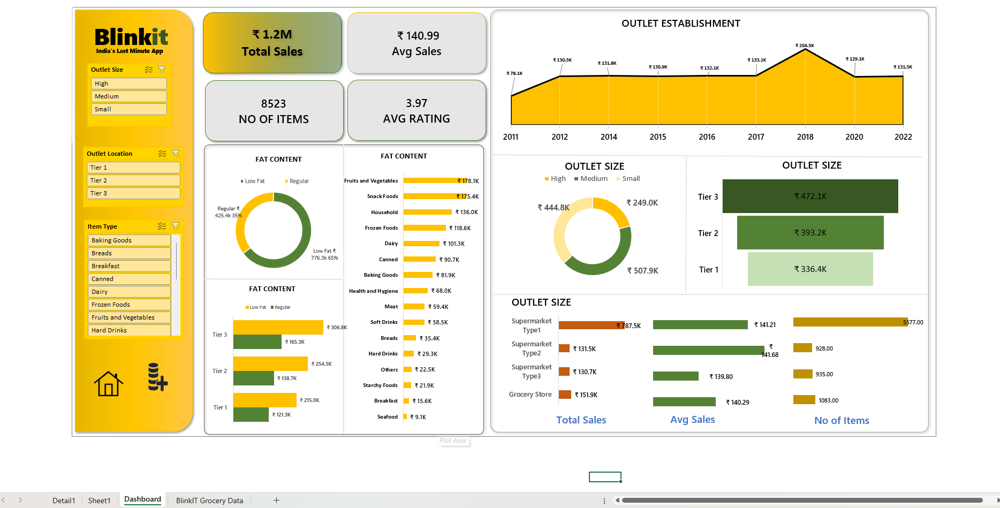

# 🛒 Blinkit Sales Dashboard

A fully interactive **Excel dashboard** built to analyze sales, item types, outlet performance, and product attributes for Blinkit — India’s last-minute delivery app. The dashboard uses **Excel features** such as **Pivot Tables, Slicers, Navigation Buttons**, and custom formatting for a seamless user experience.

 <!-- Replace with actual image path -->

---

## 📊 Project Overview

This project visualizes key sales insights and metrics, helping stakeholders monitor trends across:

- Total and average sales
- Item fat content (Low Fat vs. Regular)
- Outlet performance by size, location, and type
- Year-wise outlet establishment tracking
- Product category-wise revenue breakdown

---

## 🔧 Tools & Features Used

- **Microsoft Excel**
- **Pivot Tables**
- **Slicers (Outlet Size, Location, Item Type)**
- **Custom Navigation Buttons**
- **Conditional Formatting**
- **Dynamic Charts & Visuals**

---

## 📌 Key Metrics

| Metric              | Value        |
|---------------------|--------------|
| Total Sales         | ₹1.2M        |
| Number of Items     | 8,523        |
| Average Sales       | ₹140.99      |
| Average Rating      | 3.97         |

---

## 📈 Visual Components

- 📆 **Outlet Establishment** trend (2011–2022)
- 🧁 **Fat Content Analysis** (donut & bar charts)
- 🏬 **Outlet Size & Tier Comparison**
- 🛒 **Sales by Supermarket Type**
- 📦 **Item Type Breakdown by Revenue**

---

## 🧠 Learning Outcomes

- Built an end-to-end Excel BI dashboard
- Applied advanced Excel functions for layout, filtering, and analysis
- Enhanced storytelling through interactive visual design

---

## 📁 Project Structure

